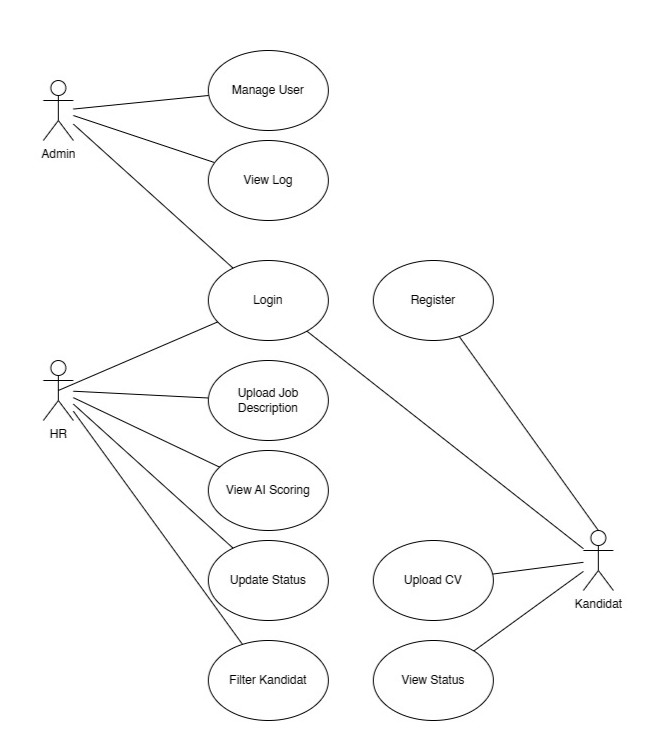
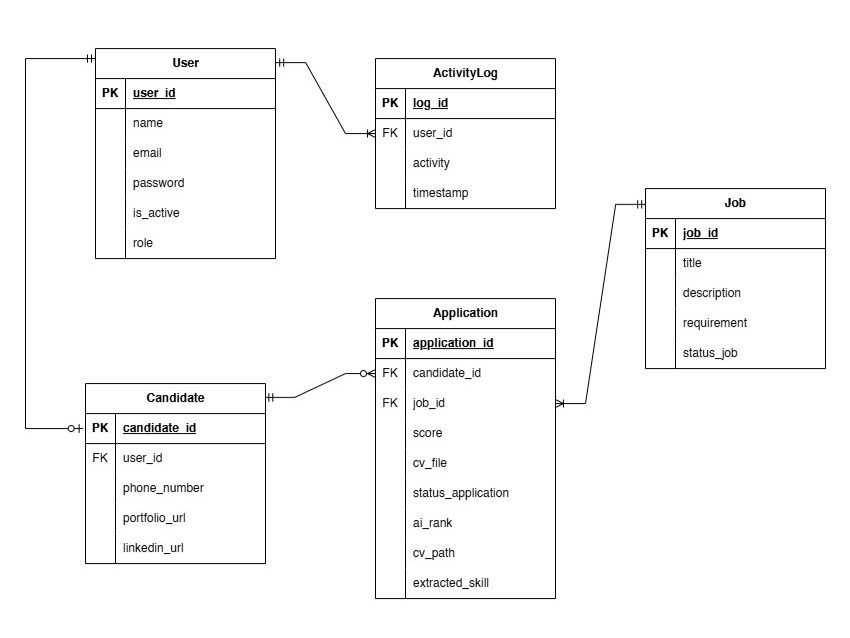
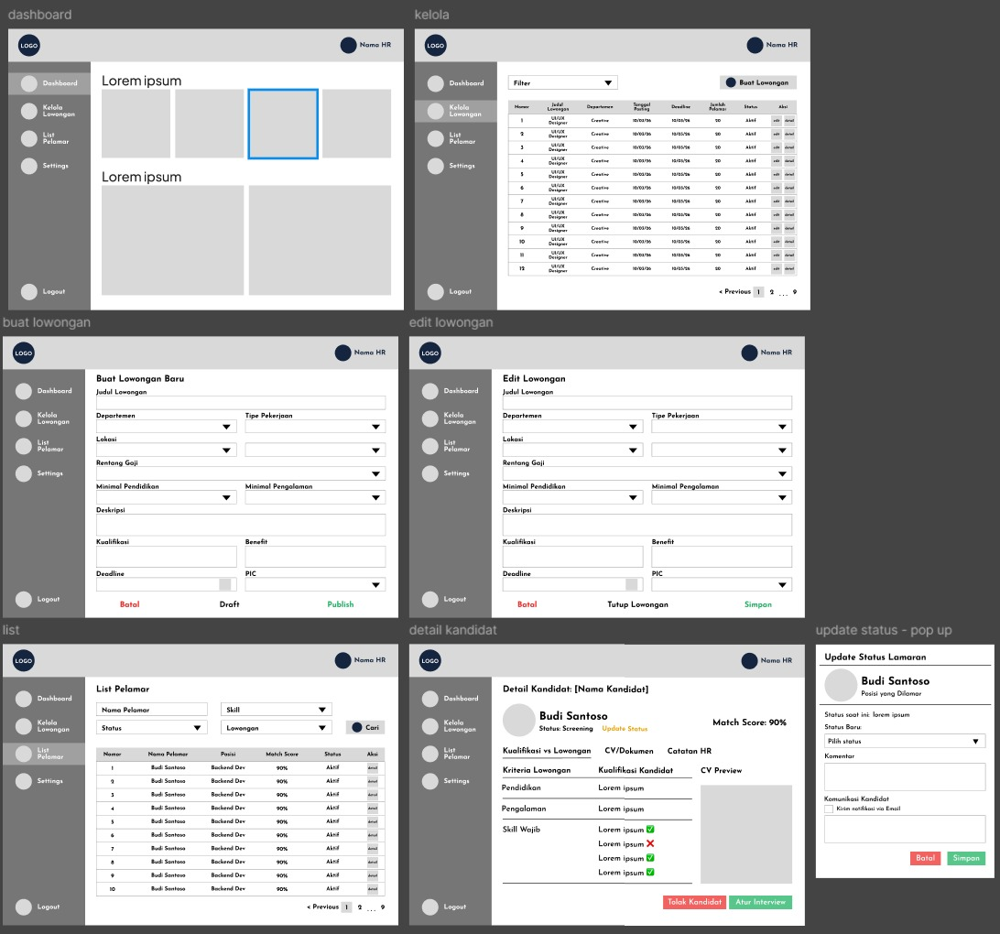
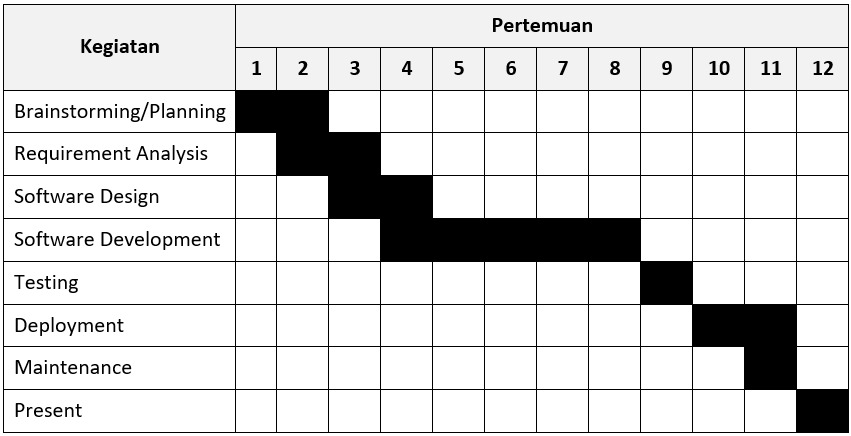

# Project Senior Project TI 
### Departemen Teknologi Elektro dan Teknologi Informasi, Fakultas Teknik, Universitas Gadjah Mada

**Nama Kelompok**: Yang Penting A

**Anggota Kelompok**:
1. **Olivia Nefri** (23/514860/TK/56532) - Project Manager, UI/UX Designer & AI Engineer
2. **Amira Syafika Pohan** (23/514788/TK/56518) - Software & Cloud Engineer
3. **Aurellya Ratna Dewanti** (23/517176/TK/56870) - UI/UX Designer, Cloud & Software Engineer

---

## **Deskripsi Produk: SnapHire**
### Nama Produk: SnapHire (HR Automation, AI-Based Recruitment)

### Jenis Produk: Web Application / Software as a Service (SaaS)

### Latar Belakang & Permasalahan
Proses screening CV yang masih dilakukan secara manual menyebabkan rekrutmen tidak efisien, memakan waktu lama, dan berisiko melewatkan kandidat potensial. SnapHire hadir untuk mengotomatisasi proses tersebut menggunakan AI agar pengambilan keputusan lebih cepat dan objektif.

### Ide Solusi & Fitur Utama
Kami mengembangkan sistem rekrutmen berbasis AI dengan fitur-fitur sebagai berikut:

| Fitur | Keterangan |
| :--- | :--- |
| **Upload file CV** | Mengupload file CV dalam format PDF/DOC ke sistem. |
| **AI CV Screening** | Menganalisis dokumen dan menampilkan skill utama kandidat secara otomatis. |
| **Dashboard HR** | Menyajikan data statistik rekrutmen yang terintegrasi. |
| **Filtering Kandidat** | Memungkinkan HR melakukan filter berdasarkan kategori tertentu. |
| **Rekomendasi** | Memberikan saran kandidat yang paling sesuai dengan kriteria lowongan. |
| **Tracking Proses** | Informasi status rekrutmen bagi HR maupun peserta. |

### Analisis Kompetitor
Berikut adalah perbandingan SnapHire dengan beberapa platform rekrutmen yang sudah ada:

| Kompetitor | Jenis | Kelebihan | Kekurangan |
| :--- | :--- | :--- | :--- |
| **Talenta (Mekari)** | Direct Competitors | Integrasi regulasi payroll Indonesia | Fitur sangat kompleks dan sangat bergantung pada cloud |
| **KitaLulus** | Indirect Competitors | Memiliki basis komunitas pelamar entry-level terbesar | Fitur screening AI untuk kecocokan mendalam masih terbatas |
| **Kalibrr** | Direct Competitors | Fokus kuat pada talent pool industri teknologi dengan skill assessment bawaan. | Harga berlangganan cenderung mahal untuk UMKM |

---

## **Metodologi SDLC**
### Metodologi yang Digunakan: **Agile (Scrum-based iteration)**

### Alasan Pemilihan Metodologi:
1. Requirement AI Dinamis: Kebutuhan sistem AI dapat berkembang seiring eksperimen model. 
2. Iterasi Akurasi: Dibutuhkan iterasi berulang untuk meningkatkan akurasi CV matching. 
3. Kecepatan MVP: Memungkinkan perilisan Minimum Viable Product (MVP) secara lebih cepat. 
4. Efisiensi Tim: Sangat cocok untuk skala tim kecil yang terdiri dari 3 orang. 

### Perancangan Tahap 1-3 SDLC
**A. Tujuan Produk**
1. Mengotomatisasi proses screening CV secara efisien. 
2. Mengurangi durasi waktu seleksi awal kandidat oleh tim HR. 
3. Menyajikan rekomendasi kandidat terbaik berbasis teknologi AI. 
4. Membantu pengambilan keputusan rekrutmen yang lebih cepat dan objektif.

**B. Pengguna Potensial dari Produk dan Kebutuhan para Pengguna Tersebut**
| Pengguna | Kebutuhan Utama |
| :--- | :--- |
| **Admin** | Mengelola akun HR Staff, mengatur hak akses pengguna, memastikan sistem berjalan dengan baik, serta memonitor data dan aktivitas rekrutmen. |
| **HR Staff** | Membuat dan mengelola lowongan pekerjaan, melihat dan mereview pelamar, mengunduh/meninjau CV kandidat, serta memperbarui status seleksi kandidat. |
| **Kandidat** | Melihat daftar lowongan yang tersedia, membuat akun dan login, mengirim lamaran beserta CV, serta memantau status lamaran yang telah diajukan. |

**C. Use Case Diagram**

**D. Functional Requirements untuk Use Case yang telah Dirancang**
| FR | Deskripsi |
| :--- | :--- |
| FR-01 | Kandidat dapat melakukan registrasi akun. |
| FR-02 | Pengguna dapat login sesuai role masing-masing. |
| FR-03 | Admin dapat membuat akun HR Staff. |
| FR-04 | Admin dapat mengubah atau menghapus akun pengguna. |
| FR-05 | HR Staff dapat membuat lowongan pekerjaan. |
| FR-06 | HR Staff dapat mengedit dan menutup lowongan pekerjaan. |
| FR-07 | Kandidat dapat melihat daftar lowongan aktif. |
| FR-08 | Kandidat dapat melamar pekerjaan dan mengunggah CV. |
| FR-09 | HR Staff dapat memperbarui status lamaran. |
| FR-10 | Kandidat dapat melihat status lamaran yang diajukan. |
| FR-11 | Sistem dapat menganalisis CV kandidat menggunakan AI untuk menilai kecocokan dengan lowongan. |
| FR-12 | Sistem menampilkan rekomendasi kandidat dan ringkasan analisis kepada HR Staff. |

**E. Entity Relationship Diagram**

**F. Low-fidelity Wireframe**

**G. Gantt-Chart 1 Semester**

